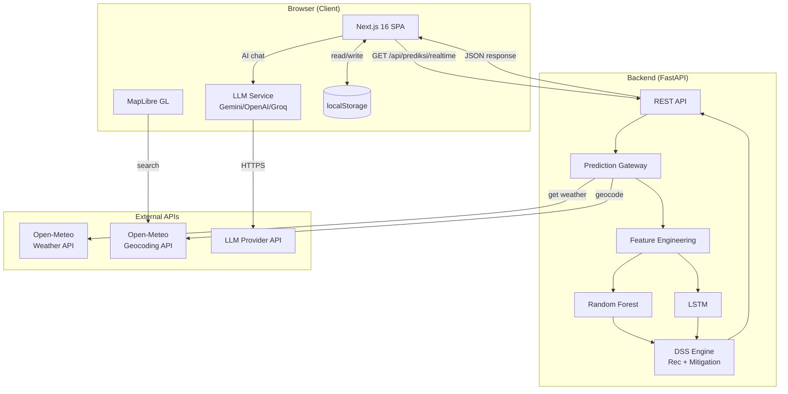

# Architecture

> Dokumen ini menjelaskan arsitektur sistem FloodRisk AI secara menyeluruh — frontend, backend, ML pipeline, LLM integration, dan alur data antar komponen.

---

## Overview Arsitektur

FloodRisk AI terdiri dari tiga lapisan utama:

```
┌─────────────────────────────────────────────────────────────────┐
│                    FRONTEND (Next.js 16)                         │
│  Dashboard  │  AI Support  │  Reports  │  Settings  │  Map      │
└──────────────────────────┬──────────────────────────────────────┘
                           │ HTTP/REST
┌──────────────────────────▼──────────────────────────────────────┐
│                    BACKEND (FastAPI)                              │
│  /prediksi/realtime  │  /prediksi/manual  │  /health  │  /info  │
└──────────────────────────┬──────────────────────────────────────┘
                           │
         ┌─────────────────┼──────────────────┐
         │                 │                  │
┌────────▼──────┐ ┌────────▼──────┐  ┌────────▼───────┐
│  Open-Meteo   │ │  Random Forest │  │  Recommendation │
│  Provider     │ │  / LSTM        │  │  + Mitigation   │
└───────────────┘ └───────────────┘  └────────────────┘
```

---

## Frontend

### Teknologi

| Teknologi | Versi | Peran |
|---|---|---|
| Next.js | 16.2.9 | App Framework, SSG |
| React | 19.2.4 | UI Library |
| Tailwind CSS | 4 | Utility-first styling |
| Framer Motion | 12 | Animasi premium |
| Recharts | 2.15 | Grafik (Gauge, Radar, Bar) |
| MapLibre GL JS | 5.24 | Peta interaktif |
| TanStack Query | 5 | Data fetching & caching |
| Lucide React | 1.21 | Icon library |
| Zod | 4 | Schema validation |

### Struktur Halaman

Aplikasi adalah **Single Page Application (SPA)**. Semua konten dirender di satu halaman (`app/page.tsx`).

```
app/page.tsx
  └── <Sidebar>          — Navigasi floating kiri
  └── <ResizablePanel>   — Panel kiri yang bisa di-resize
  │     └── DashboardPanel    (activeMenu === "dashboard")
  │     └── AISupportPanel    (activeMenu === "ai-support")
  │     └── ReportsPanel      (activeMenu === "reports")
  │     └── SettingsPanel     (activeMenu === "settings")
  │     └── AboutPanel        (activeMenu === "about")
  └── <MapContainer>     — Peta MapLibre (selalu aktif)
```

### State Management

Tidak menggunakan library state management eksternal (Redux, Zustand). Menggunakan:

- **`useWorkspaceStore`** — Menu aktif (useState lokal)
- **`useWilayahSync`** — Sinkronisasi wilayah aktif (localStorage)
- **`useSearchHistory`** — Riwayat pencarian (localStorage)
- **`useConversationStore`** — Percakapan AI per wilayah (localStorage)
- **`useRealtimePrediction`** — Fetch data via TanStack Query (cache 5 menit)

---

## Backend

### Teknologi

| Teknologi | Peran |
|---|---|
| FastAPI | REST API framework |
| Uvicorn | ASGI server |
| Python 3.12 | Runtime |
| Pydantic | Request/response validation |
| joblib | Model serialization (Random Forest) |
| TensorFlow/Keras | Model inference (LSTM) |
| pandas | Feature engineering |
| requests | HTTP client (Open-Meteo) |

### Router Structure

```
backend/
  app.py              — FastAPI instance + middleware + router registration
  middleware.py       — Request/response logging
  routers/
    health.py         — GET /api/health, GET /api/health/detail
    prediction.py     — POST /api/prediksi/manual, POST /api/prediksi/engineered
    csv_prediction.py — POST /api/prediksi/csv, POST /api/prediksi/csv/download
    realtime.py       — GET /api/prediksi/realtime
    info.py           — GET /api/info/model, GET /api/info/version
    provider.py       — GET /api/provider/openmeteo
  services/
    prediction_gateway.py — Unified entry point untuk semua prediksi
    predictor_service.py  — Delegasi ke ML service
    metadata_service.py   — Info model dan versi
  providers/
    openmeteo_provider.py — Implementasi Open-Meteo API
    geocoding.py          — Geocoding via Open-Meteo
    weather_provider.py   — Abstract base class
    models.py             — RawWeatherData dataclass
    exceptions.py         — Custom exceptions
```

### Prediction Gateway

Semua jalur prediksi masuk melalui satu titik terpusat:

```python
predict_from_raw(weather: RawWeatherData, weather_history=None, model="rf", top_n=5)
```

Gateway melakukan:
1. Feature engineering dari raw weather data
2. Menambahkan rolling features dari history 14 hari
3. Memanggil ML predictor (RF atau LSTM)
4. Mengklasifikasikan risiko
5. Menghasilkan rekomendasi + mitigasi

---

## Machine Learning

### Random Forest (Model Utama)

| Parameter | Nilai |
|---|---|
| Algoritma | RandomForestRegressor |
| Jumlah Trees | 100 |
| Target | FRI (0–100, continuous) |
| Fitur | 9 fitur cuaca |
| Training Data | 726 records BMKG 2018–2024 |
| Artifact | `ml/artifacts/random_forest.pkl` |

### LSTM (Model Sekunder)

| Parameter | Nilai |
|---|---|
| Arsitektur | Sequential LSTM |
| Lookback Window | 7 langkah waktu |
| Target | FRI (0–100) |
| Fitur | 9 fitur cuaca |
| Artifact | `ml/artifacts/best_lstm.keras` |
| Scaler | `ml/artifacts/scaler_lstm.pkl` |

### 9 Fitur Model

| Fitur | Deskripsi |
|---|---|
| `rr` | Curah hujan hari ini (mm) |
| `rain3` | Total curah hujan 3 hari terakhir |
| `rain7` | Total curah hujan 7 hari terakhir |
| `rain14` | Total curah hujan 14 hari terakhir |
| `rh_avg` | Kelembapan relatif rata-rata (%) |
| `temp_range` | Rentang suhu harian (tmax - tmin) |
| `rainfall_anomaly` | Anomali curah hujan vs rata-rata historis |
| `month` | Bulan (1–12) |
| `day_of_year` | Hari dalam tahun (1–366) |

### FRI Classification

```
0  – 33  → Risiko Rendah  (Tanam normal)
34 – 66  → Risiko Sedang  (Tanam dengan pencegahan)
67 – 100 → Risiko Tinggi  (Tunda atau lindungi)
```

---

## Open-Meteo Integration

Open-Meteo digunakan sebagai sumber data cuaca realtime. Tidak memerlukan API key.

```
Frontend (search "Pekanbaru")
  ↓
Backend GET /api/prediksi/realtime?wilayah=Pekanbaru
  ↓
OpenMeteoProvider.get_weather_history(wilayah, days=14)
  ↓
Open-Meteo Geocoding API → koordinat lat/lon
  ↓
Open-Meteo Forecast API → 14 hari data harian
  ↓ (precipitation_sum, rh_2m_mean, tmax, tmin)
Feature Engineering (rolling + anomaly)
  ↓
Random Forest Prediction
  ↓
Response JSON
```

---

## LLM Integration

LLM digunakan untuk AI Decision Support. Mendukung 4 provider:

```
AISupportPanel
  ↓
useConversationStore (localStorage, keyed by wilayah_date)
  ↓
chat(data, history, userMessage) — services/llm.ts
  ↓
buildMessages(data, history, userMessage)
  │  ├── SYSTEM_PROMPT (domain-locked, format enforcement)
  │  ├── KNOWLEDGE (FRI, komoditas, mitigasi)
  │  └── buildContext(data) — data prediksi aktual
  ↓
Provider Router
  ├── callGemini()    — Gemini 2.0 Flash
  ├── callOpenAI()    — GPT-4o-mini
  ├── callAnthropic() — Claude 3 Haiku
  └── callGroq()      — LLaMA 3.1 8B
  ↓
Response → MarkdownContent renderer
```

### Environment Variables LLM

```
NEXT_PUBLIC_LLM_PROVIDER=gemini   # gemini|openai|anthropic|groq
NEXT_PUBLIC_LLM_API_KEY=xxx
```

---

## Export PDF Flow

```
User klik "Export PDF" atau "Print Report"
  ↓
openPrintWindow({ data }) — components/report/ReportPrintWindow.tsx
  ↓
window.open() — buka jendela baru
  ↓
Write HTML skeleton:
  - Inter font (Google Fonts)
  - Link ke /print-report.css (public static)
  ↓
createRoot(#print-root).render(<PrintableReport data={data} />)
  ↓
Tunggu stylesheet load + document.fonts.ready
  ↓
window.print() → Dialog cetak / Save as PDF
```

### PrintableReport — 3 Halaman A4

```
Halaman 1: Cover + Executive Summary + Weather Table + FRI Gauge
Halaman 2: Recommendation Table + Mitigation Table
Halaman 3: Quick Insights + Metadata + Disclaimer + Authors
```

---

## MapLibre Integration

```
MapContainer
  ├── GeoJSON source (batas wilayah Riau dari /geo/riau-simplified.geojson)
  ├── Fill layer (warna berdasarkan risiko)
  ├── Symbol layer (label nama wilayah)
  ├── Marker layer (hasil pencarian)
  ├── PolygonInteraction (hover + click)
  └── RegionPopup (popup detail wilayah)
```

---

## Diagram Arsitektur Lengkap (Mermaid)


