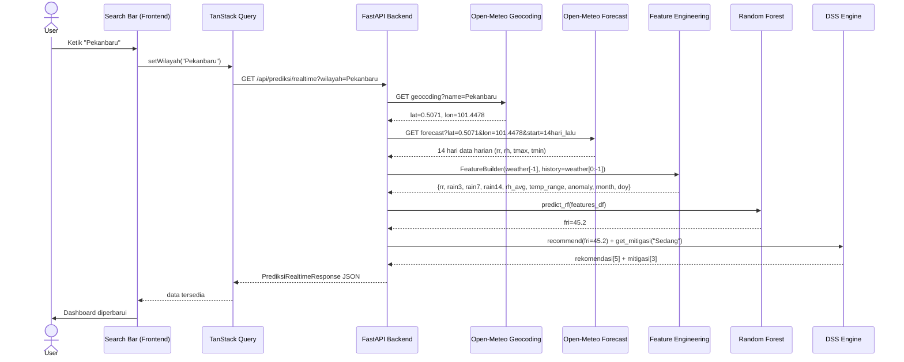

# Data Flow

> Diagram dan penjelasan alur data end-to-end FloodRisk AI — dari input pengguna hingga hasil prediksi ditampilkan di dashboard dan laporan.

---

## Alur Prediksi Realtime (Happy Path)



---

## Alur Feature Engineering

Data cuaca mentah dari Open-Meteo diubah menjadi 9 fitur model:

```
Input: RawWeatherData (tanggal, rr, rh_avg, tmax, tmin, lat, lon)
       + history: List[RawWeatherData] (13 hari sebelumnya)

FeatureBuilder.build()
  ├── rr              → langsung dari input
  ├── rh_avg          → langsung dari input
  ├── rain3           → sum(rr hari[-3:])
  ├── rain7           → sum(rr hari[-7:])
  ├── rain14          → sum(rr hari[-14:])
  ├── temp_range      → tmax - tmin
  ├── rainfall_anomaly → rr / mean(rr_historis) (atau 1.0 jika tidak ada history)
  ├── month           → tanggal.month
  └── day_of_year     → tanggal.timetuple().tm_yday

Output: dict dengan 9 fitur
```

---

## Alur Scoring Komoditas

```
fri = 45.2  (contoh)

scorer.score_commodities(fri)
  ├── Load commodity_profiles.json (17 komoditas)
  ├── Untuk setiap komoditas:
  │     skor = base_score × tolerance_factor × risk_penalty
  │     (detail formula ada di ml/recommendation/scorer.py)
  ├── Sort descending
  └── Return top-N

recommender.recommend(fri, top_n=5)
  └── Tambah peringkat dan tingkat_keyakinan

explain.explain_recommendation(komoditas_id, fri, skor, keyakinan)
  └── Generate alasan[] dalam Bahasa Indonesia
  └── Generate ringkasan teks
```

---

## Alur AI Decision Support

```
User ketik pertanyaan → sendMessage(text)
  │
  ├── useConversationStore.addMessage({role:"user", content:text})
  │     └── Simpan ke localStorage["floodrisk_ai_conversations"]["Pekanbaru_2026-07-01"]
  │
  ├── chat(data, messages, text) → services/llm.ts
  │     ├── buildMessages():
  │     │     ├── [system] SYSTEM_PROMPT (domain-locked, format enforcement)
  │     │     ├── [system] KNOWLEDGE + buildContext(data)  ← data prediksi aktual
  │     │     ├── [...history.slice(-12)]  ← max 6 exchange terakhir
  │     │     └── [user] text
  │     └── callGemini() / callOpenAI() / callAnthropic() / callGroq()
  │
  ├── Response text → addMessage({role:"assistant", content:response})
  │     └── Simpan ke localStorage
  │
  └── MarkdownContent render response
        ├── ## Heading → <h3 className="ai-heading">
        ├── **bold** → <strong>
        ├── - bullet → <ul><li>
        └── Paragraf → <p className="ai-paragraph">
```

---

## Alur Export PDF

```
User klik "Export PDF"
  │
  └── openPrintWindow({ data })
        │
        ├── window.open("", "_blank")  ← buka jendela baru
        ├── write HTML skeleton:
        │     - <link rel="stylesheet" href="/print-report.css">
        │     - <link href="Google Fonts Inter">
        │     - <div id="print-root">
        │
        ├── createRoot(#print-root).render(<PrintableReport data={data} />)
        │     ├── Page 1: PageHeader + Cover + Executive Summary + Weather Table + FRI Gauge
        │     ├── Page 2: PageHeader + Recommendation Table + Mitigation Table
        │     └── Page 3: PageHeader + Quick Insights + Metadata + Disclaimer
        │
        ├── Tunggu: stylesheet.onload + document.fonts.ready
        ├── setTimeout(300ms)  ← buffer untuk React render selesai
        └── window.print()  ← dialog cetak browser
```

---

## Alur Riwayat Pencarian

```
useWilayahSync               useSearchHistory
  wilayah aktif                riwayat multi-kota
  localStorage                 localStorage
      │                             │
      │ setWilayah()                │ upsert(entry)
      ▼                             ▼
useRealtimePrediction(wilayah)   MapContainer
  TanStack Query                  marker per kota
  staleTime: 5 menit              popup + "Lihat Detail"
      │
      ▼
data → Dashboard, AI Support, Reports
```

---

## Alur Persistensi Percakapan AI

```
Region berubah (Pekanbaru → Kampar):

  useConversationStore(wilayah="Kampar", forecastDate="2026-07-01")
    ├── key = "Kampar_2026-07-01"
    ├── if key !== activeKey:
    │     setMessages(loadStore()["Kampar_2026-07-01"] ?? [])
    └── [percakapan Pekanbaru tersimpan aman di localStorage]

Kembali ke Pekanbaru:
    ├── key = "Pekanbaru_2026-07-01"
    └── setMessages(loadStore()["Pekanbaru_2026-07-01"])  ← dipulihkan
```

---

## Struktur localStorage

```json
{
  "floodrisk_last_wilayah": "Pekanbaru",
  "floodrisk_search_history": [
    { "wilayah": "Pekanbaru", "fri": 45.2, "tingkatRisiko": "Risiko Sedang", ... },
    { "wilayah": "Kampar", "fri": 28.0, "tingkatRisiko": "Risiko Rendah", ... }
  ],
  "floodrisk_ai_conversations": {
    "Pekanbaru_2026-07-01": [
      { "role": "user", "content": "Apa arti FRI saya?" },
      { "role": "assistant", "content": "## Penjelasan FRI\n..." }
    ],
    "Kampar_2026-07-01": []
  },
  "floodrisk_theme": "dark",
  "floodrisk_panel_width": 380
}
```
